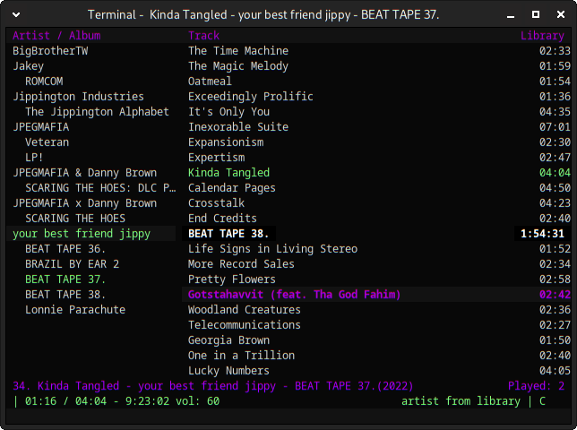

# This repository contains the 'bb' theme for CMUS.

Clone the repository: git clone https://github.com/thiswombat/cmus-theme-bb

Copy the theme files: Copy the bb.theme file to ~/.config/cmus

Apply the theme: Open CMUS, enter the command line by pressing `:` and entering `colorscheme bb`

For more information on using CMUS, refer to the official CMUS documentation.

If you encounter any issues with the theme or would like to suggest improvements, feel free to open an issue or submit a pull request on GitHub.

This theme is released under the GNU General Public License v3.0. You can find the full license text in the LICENSE file.
